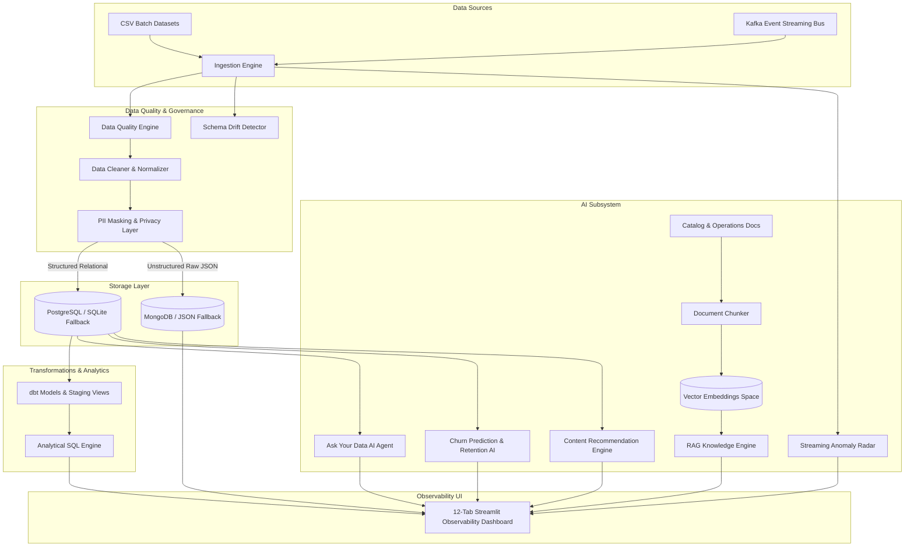

# DataStream AI
### *“From Raw Data to Intelligent Insights”*

[](https://python.org)
[](https://streamlit.io)
[](https://postgresql.org)
[](https://mongodb.com)
[](https://kafka.apache.org)
[](#-automated-testing)
[](LICENSE)

> **Portfolio Scope Notice:**  
> *“This project is a portfolio-scale prototype demonstrating modern data engineering and AI concepts. It is not intended to represent a production-ready enterprise data platform.”*

---

## 📌 Executive Overview

**DataStream AI** is a full-stack, enterprise-grade Data Engineering and AI Analytics platform designed around a modern OTT content streaming ecosystem (simulating platforms like Netflix, Prime Video, or Hotstar).

It demonstrates how raw, imperfect user activity event streams (logins, content views, watch sessions, searches, watchlist additions, and subscriptions) travel through an automated end-to-end data pipeline:
1. **Ingestion & Validation**: Schema validation, timestamp formatting, anomaly detection, and schema drift monitoring.
2. **Quality Engineering**: Reusable data quality scoring engine, rule violation logging, deduplication, and PII redaction (DPDP compliance).
3. **Multi-Model Warehousing**: Relational tables in PostgreSQL (with automatic zero-fail SQLite local fallback) and raw document storage in MongoDB (with local JSON fallback).
4. **Transformations & Analytics**: dbt-style staging views and marts (`fact_user_activity`, `analytics_daily_usage`) and an advanced SQL suite featuring CTEs, Window Functions (`DENSE_RANK`), and cohort retentions.
5. **Predictive & Contextual AI Suite**:
   - **Subscriber Churn Prediction & Retention AI**: Inactivity decay, QoS friction, and churn probability scoring with prescriptive win-back actions.
   - **Personalized Content Recommender**: Hybrid content-based and collaborative filtering with AI match explanations and similarity radar.
   - **Streaming Anomaly Radar**: Real-time multi-IP credential sharing and CDN buffering spike detection.
   - **Natural Language "Ask Your Data"**: Text-to-SQL analytics agent grounded on relational tables.
   - **Semantic Knowledge Base (RAG)**: Sliding-window chunker and vector retrieval over content catalog and operational documentation.
6. **Observability Dashboard**: High-fidelity, **12-tab** Streamlit observability dashboard delivering real-time streaming controls, metric cards, Plotly charts, and telemetry diagnostics.

---

## 🏛️ System Architecture



---

## 🚀 Key Features

| Capability | Implementation Detail |
| :--- | :--- |
| **Realistic OTT Ingestion** | Pre-built datasets for `users.csv`, `content.csv`, `subscriptions.csv`, and `events.csv` with intentional dirty rows to test validation. |
| **Data Quality Engine** | Dynamically calculates DQ score (0–100%), catching duplicates, negative stream times, invalid event types, and unparseable dates. |
| **Schema Drift Detector** | Flags new columns (expansion), missing columns, and data type mismatches with severity alerts. |
| **Zero-Config Resilient Fallbacks** | Automatically falls back from PostgreSQL to SQLite (`data/datastream.db`), MongoDB to local JSON, and Kafka to an in-memory streaming simulator if external services are offline. |
| **Self-Healing Pipeline Prototype**| Configurable retry supervisor with exponential backoff handling transient network glitches during ETL extraction. |
| **Privacy & DPDP Governance** | Automated detection and regex masking of PII (emails: `d********y@gmail.com`, phones, IPv4 addresses: `192.168.*.*`). |
| **dbt Staging & Marts** | SQL models for `stg_events`, `stg_users`, `fact_user_activity`, and `analytics_daily_usage` with schema tests (`unique`, `not_null`, `accepted_values`). |
| **Airflow Orchestration** | Standard Airflow DAG (`airflow/data_pipeline.py`) defining the 5-step ETL pipeline: `extract` ➔ `validate` ➔ `transform` ➔ `load` ➔ `quality_check`. |
| **Subscriber Churn AI** | Predictive churn risk engine with diagnostic gauges, inactivity decay tracking, and prescriptive retention actions. |
| **Content Recommender** | Hybrid content/collaborative filtering with user taste profiling, match score badges, and similarity radar. |
| **Streaming Anomaly Radar** | Telemetry monitor catching credential sharing across multiple IPs/devices and QoS playback friction spikes. |
| **AI "Ask Your Data"** | Natural language to SQL analytics engine delivering factual, grounded responses without hallucinations. |
| **Knowledge Base (RAG)** | Sliding-window text chunker and vector similarity search (TF-IDF + Cosine similarity, with optional Gemini API support). |
| **Streamlit Observability UI** | 12 interactive tabs with KPI metrics, real-time streaming controls, Plotly charts, and query explorers. |

---

## 💻 Tech Stack

- **Core & Data Processing:** Python 3.12, Pandas, NumPy, Scikit-learn
- **Databases:** PostgreSQL (Relational Warehouse), SQLite (Local Fallback), SQLAlchemy, MongoDB / PyMongo (Document Store)
- **Streaming:** Apache Kafka (Confluent Platform), Python Kafka Producer/Consumer, In-Memory Event Bus Fallback
- **Transformations & Orchestration:** dbt-style models and assertions, Apache Airflow DAG
- **Predictive & Generative AI:** Churn Predictor, Content Recommender, Anomaly Radar, Vector Space (TF-IDF & Cosine Similarity), Sliding-Window Chunker, Google Gemini API (Optional hybrid)
- **Dashboard & Visualization:** Streamlit, Plotly Express & Graph Objects, Custom Modern Dark CSS
- **Containerization & Testing:** Docker Compose, Pytest

---

## 📂 Project Structure

```text
datastream-ai/
├── app/
│   └── dashboard.py          # 12-tab modern Streamlit observability dashboard
├── pipeline/
│   ├── ingestion.py          # CSV and streaming ingestion engine
│   ├── cleaning.py           # Deduplication, normalization, and date formatting
│   ├── validation.py         # Data Quality rules & dynamic scoring engine
│   ├── schema_drift.py       # Baseline comparison and schema drift alerts
│   ├── privacy.py            # PII detection and regex redaction
│   ├── etl_pipeline.py       # End-to-end ETL orchestrator with retry resilience
│   ├── dbt_runner.py         # dbt staging views and marts executor
│   └── anomaly_detector.py   # Real-time streaming anomaly & fraud radar
├── database/
│   ├── postgres.py           # Relational manager with zero-fail SQLite fallback
│   ├── mongodb.py            # Raw event document manager with local JSON fallback
│   └── schema.sql            # ANSI SQL relational schema DDL
├── kafka/
│   ├── producer.py           # Streaming event emitter with local queue fallback
│   └── consumer.py           # Stream consumer with real-time validation and routing
├── ai/
│   ├── churn_predictor.py    # Subscriber churn prediction & retention AI
│   ├── recommendation.py     # Personalized OTT content recommendation engine
│   ├── chunking.py           # Document cleaner and sliding-window chunker
│   ├── embeddings.py         # Local vector similarity engine & Gemini bridge
│   ├── rag.py                # Retrieval Augmented Generation engine
│   └── ask_data.py           # Natural language "Ask Your Data" analytics agent
├── airflow/
│   └── data_pipeline.py      # Apache Airflow DAG (extract->validate->transform->load->quality)
├── dbt/
│   ├── dbt_project.yml       # dbt project definition
│   └── models/               # Staging models, marts, and schema test assertions
├── sql/
│   └── analytics.sql         # Portfolio SQL suite (CTEs, Window Functions, Joins)
├── data/
│   ├── users.csv             # Realistic user profiles with intentional test duplicate
│   ├── content.csv           # Catalog titles, genres, ratings, and durations
│   ├── subscriptions.csv     # Subscription plans, pricing, and statuses
│   └── events.csv            # User activity telemetry with intentional dirty test records
├── docs/
│   ├── architecture.md       # Architectural deep-dive & Mermaid diagrams
│   ├── platform_overview.txt # OTT platform operations guide for RAG
│   └── ott_content_catalog.txt# Content catalog synopses for RAG
├── tests/
│   ├── conftest.py           # Pytest root configuration
│   ├── test_pipeline.py      # Data validation, PII, and ETL tests (11 tests)
│   └── test_ai_features.py   # Churn, recommender, and anomaly tests (8 tests)
├── .env.example              # Environment variables template
├── requirements.txt          # Python dependencies
├── docker-compose.yml        # Multi-container setup (Postgres, Mongo, Kafka, Streamlit)
├── Dockerfile                # Production container image definition
├── AI_DEVELOPMENT.md         # Documentation of AI-assisted engineering & debugging
├── LICENSE                   # MIT License
└── README.md                 # Project documentation
```

---

## ⚙️ Quick Start & Setup Instructions

### 1. Clone & Set Up Virtual Environment
```bash
git clone https://github.com/your-username/datastream-ai.git
cd datastream-ai

# Create virtual environment
python -m venv venv

# Activate (Windows)
venv\Scripts\activate
# Activate (macOS/Linux)
source venv/bin/activate

# Install dependencies
pip install -r requirements.txt
```

### 2. Configure Environment Variables
Copy the template configuration:
```bash
cp .env.example .env
```
*Note: All external services (PostgreSQL, MongoDB, Kafka, Gemini) are optional. If they are not running, DataStream AI will automatically use its built-in local fallbacks.*

### 3. Run the Streamlit Dashboard
```bash
streamlit run app/dashboard.py
```
Open [http://localhost:8501](http://localhost:8501) in your browser.

---

## 🧪 Automated Testing

Execute the comprehensive test suite covering data validation, schema drift, PII masking, ETL transformations, churn prediction, content recommendations, and anomaly detection:
```bash
python -m pytest tests/ -v
```
**Test Results (19/19 Passed):**
```text
tests/test_ai_features.py::TestChurnPredictor::test_predict_all_users_structure PASSED [  5%]
tests/test_ai_features.py::TestChurnPredictor::test_predict_single_user PASSED          [ 10%]
tests/test_ai_features.py::TestChurnPredictor::test_fleet_summary PASSED               [ 15%]
tests/test_ai_features.py::TestContentRecommender::test_recommend_for_active_user PASSED [ 21%]
tests/test_ai_features.py::TestContentRecommender::test_cold_start_user PASSED          [ 26%]
tests/test_ai_features.py::TestContentRecommender::test_similar_content PASSED         [ 31%]
tests/test_ai_features.py::TestAnomalyDetector::test_anomaly_analysis_returns_list PASSED [ 36%]
tests/test_ai_features.py::TestAnomalyDetector::test_summary_metrics PASSED           [ 42%]
tests/test_pipeline.py::TestPrivacyAndPII::test_mask_email PASSED                     [ 47%]
tests/test_pipeline.py::TestPrivacyAndPII::test_mask_phone PASSED                     [ 52%]
tests/test_pipeline.py::TestPrivacyAndPII::test_mask_ip PASSED                        [ 57%]
tests/test_pipeline.py::TestPrivacyAndPII::test_mask_dataframe PASSED                 [ 63%]
tests/test_pipeline.py::TestDataQualityAndValidation::test_duplicate_detection PASSED  [ 68%]
tests/test_pipeline.py::TestDataQualityAndValidation::test_invalid_event_type_rejection PASSED [ 73%]
tests/test_pipeline.py::TestDataQualityAndValidation::test_negative_numeric_rejection PASSED [ 78%]
tests/test_pipeline.py::TestSchemaDrift::test_new_column_detection PASSED              [ 84%]
tests/test_pipeline.py::TestSchemaDrift::test_missing_column_detection PASSED          [ 89%]
tests/test_pipeline.py::TestCleaningAndTransformation::test_event_cleaning_deduplication PASSED [ 94%]
tests/test_pipeline.py::TestDatabaseAndSQL::test_database_query_execution PASSED      [100%]

============================= 19 passed in 7.97s ==============================
```

---

## 🐳 Running with Docker Compose (Optional)

To launch the full containerized infrastructure:
```bash
docker-compose up -d
```
This initializes:
- **PostgreSQL 15** on port `5432` with auto-loaded schema DDL
- **MongoDB 6.0** on port `27017`
- **Apache Kafka & Zookeeper** on port `9092`
- **Streamlit Dashboard** on port `8501`

---

## 🔒 Privacy & DPDP Data Governance

- **Data Minimization**: Only necessary analytical telemetry is stored in structured warehouse marts.
- **Automated PII Redaction**: Personal identifiers (e.g. `debasmita.roy@gmail.com` ➔ `d*********y@gmail.com`, phone digits, and IP addresses) are redacted at the ingestion boundary.
- **Audit Trails**: Ingestion runs, schema changes, and rejected records are logged with timestamps.

---

## 📄 License

This project is licensed under the **MIT License** — see the [LICENSE](LICENSE) file for details.

Copyright (c) 2026 Debasmita Bose.
