# DataStream AI
### *“From Raw Data to Intelligent Insights”*

[](https://python.org)
[](https://streamlit.io)
[](https://postgresql.org)
[](https://mongodb.com)
[](https://kafka.apache.org)
[](#-automated-testing--quality-assurance)
[](LICENSE)
[](#)

> [!NOTE]
> **Portfolio Scope Notice:**  
> *“This project is a portfolio-scale prototype demonstrating modern data engineering, distributed streaming, automated data governance, and applied AI concepts in an OTT media context. It is engineered with production design patterns, resilient offline fallbacks, and zero-configuration local execution.”*

---

## 📑 Table of Contents
1. [Executive Overview & Problem Statement](#-executive-overview--problem-statement)
2. [End-to-End System Architecture](#-end-to-end-system-architecture)
3. [Data Pipeline & Self-Healing Resilience Lifecycle](#-data-pipeline--self-healing-resilience-lifecycle)
4. [Real-Time Streaming & Kafka Architecture](#-real-time-streaming--kafka-architecture)
5. [Data Quality Engine, Governance & DPDP Compliance](#-data-quality-engine-governance--dpdp-compliance)
6. [Multi-Model Polyglot Storage Architecture](#-multi-model-polyglot-storage-architecture)
7. [Transformations, dbt Marts & Analytical SQL Suite](#-transformations-dbt-marts--analytical-sql-suite)
8. [Predictive & Generative AI Subsystems](#-predictive--generative-ai-subsystems)
   - [Subscriber Churn Prediction & Retention Engine](#1-subscriber-churn-prediction--retention-engine)
   - [Personalized Content Recommender](#2-personalized-content-recommendation-engine)
   - [Streaming Anomaly & Security Radar](#3-streaming-anomaly--security-radar)
   - [Natural Language "Ask Your Data" Analytics Agent](#4-natural-language-ask-your-data-analytics-agent)
   - [Semantic Knowledge Base (RAG Subsystem)](#5-semantic-knowledge-base-rag-subsystem)
9. [Streamlit Observability Dashboard (12 Interactive Modules)](#-streamlit-observability-dashboard-12-interactive-modules)
10. [Apache Airflow Orchestration](#-apache-airflow-orchestration)
11. [Project File & Directory Layout](#-project-file--directory-layout)
12. [Quick Start & Setup Instructions](#-quick-start--setup-instructions)
13. [Automated Testing & Quality Assurance](#-automated-testing--quality-assurance)
14. [Docker Containerized Deployment](#-docker-containerized-deployment)
15. [License & Acknowledgments](#-license--acknowledgments)

---

## 📌 Executive Overview & Problem Statement

Modern Over-The-Top (OTT) streaming entertainment platforms—such as Netflix, Amazon Prime Video, Disney+ Hotstar, and Spotify—operate in hyper-scale, data-intensive environments. Every second, consumer client devices generate massive volumes of continuous telemetry events: heartbeats, playback starts, pause/resume events, buffering QoS alerts, search queries, watchlist modifications, and subscription renewals. 

### The Core Challenges in Streaming Data Engineering:
1. **Heterogeneous & Unreliable Streams:** Telemetry arrives out-of-order, containing duplicate packets, dropped fields, corrupted session IDs, or negative watch durations caused by mobile connectivity handoffs.
2. **Schema Drift Across Client Releases:** When mobile, web, and Smart TV apps roll out independent updates, new columns emerge and old fields disappear without server-side coordination.
3. **Strict Data Governance & Privacy Regulations:** Modern regulatory frameworks (such as the **Digital Personal Data Protection (DPDP) Act 2023** and **GDPR**) mandate rigorous data minimization, purpose limitation, and PII pseudonymization before analytical persistence.
4. **The Latency Gap Between Data and Action:** High-value business decisions—such as detecting subscriber churn risk, isolating CDN buffering bottlenecks, preventing credential-sharing fraud, or delivering personalized content recommendations—cannot afford 24-hour batch processing delays.

### The DataStream AI Solution:
**DataStream AI** bridges this divide by delivering an integrated, full-stack Data Engineering and AI Analytics platform. It transforms raw, dirty streaming telemetry into auditable, clean, dimensional data models, and feeds that data directly into real-time operational AI engines.

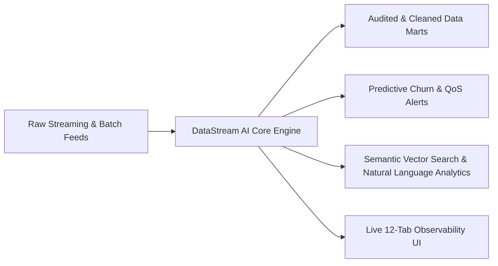
```mermaid
flowchart LR
    A[Raw Streaming & Batch Feeds] --> B[DataStream AI Core Engine]
    B --> C[Audited & Cleaned Data Marts]
    B --> D[Predictive Churn & QoS Alerts]
    B --> E[Semantic Vector Search & Natural Language Analytics]
    B --> F[Live 12-Tab Observability UI]
```

### High-Level Capabilities Summary:
- **Resilient Ingestion:** Dual-path batch (CSV) and streaming (Apache Kafka) ingestion with automatic in-memory queue fallback for offline execution.
- **Dynamic Quality Engineering:** Automated calculation of Data Quality Scores (0–100%), pre-flight schema drift detection, and regex-powered PII masking.
- **Polyglot Warehousing:** Structured ACID relational storage in PostgreSQL (with automatic zero-fail SQLite fallback) paired with un-redacted document storage in MongoDB (with JSON file fallback).
- **dbt-Style Dimensional Modeling:** Modular staging views, star-schema marts (`fact_user_activity`, `analytics_daily_usage`), and advanced window-function analytics.
- **Operational AI Suite:** Heuristic churn risk scoring, hybrid collaborative/content recommendations, streaming fraud detection, natural language Text-to-SQL querying, and RAG-based semantic catalog search.
- **Unified Observability:** A modern 12-tab Streamlit dashboard delivering real-time telemetry gauges, interactive Plotly visualizations, streaming triggers, and pipeline health monitoring.

---

## 🏛️ End-to-End System Architecture

DataStream AI follows a decoupled, multi-tiered architecture that separates ingestion, validation, persistence, transformation, inference, and visualization.

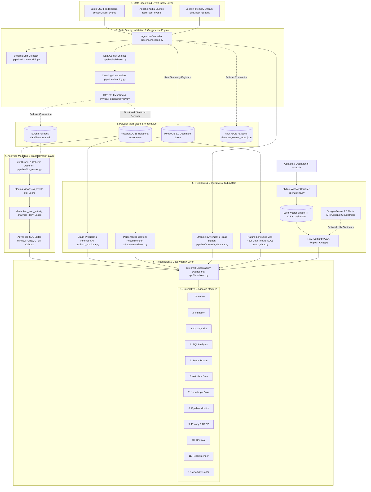
```mermaid
flowchart TD
    %% TIER 1: DATA SOURCES
    subgraph SOURCETIER["1. Data Ingestion & Event Inflow Layer"]
        CSV[Batch CSV Feeds: users, content, subs, events]
        KAFKA_BUS[Apache Kafka Cluster: topic 'user-events']
        SIM_BUS[Local In-Memory Stream Simulator Fallback]
    end

    %% TIER 2: QUALITY & GOVERNANCE
    subgraph GOVTIER["2. Data Quality, Validation & Governance Engine"]
        ING_ENG[Ingestion Controller: pipeline/ingestion.py]
        DRIFT[Schema Drift Detector: pipeline/schema_drift.py]
        DQ_ENG[Data Quality Engine: pipeline/validation.py]
        CLEAN_ENG[Cleaning & Normalizer: pipeline/cleaning.py]
        PII_ENG[DPDP/PII Masking & Privacy: pipeline/privacy.py]
    end

    %% TIER 3: PERSISTENCE
    subgraph STORETIER["3. Polyglot Multi-Model Storage Layer"]
        PG[(PostgreSQL 15 Relational Warehouse)]
        SQLITE[(SQLite Fallback: data/datastream.db)]
        MONGO[(MongoDB 6.0 Document Store)]
        JSON_STORE[(Raw JSON Fallback: data/raw_events_store.json)]
    end

    %% TIER 4: TRANSFORMATION
    subgraph TRANSTIER["4. Analytics Modeling & Transformation Layer"]
        DBT_RUN[dbt Runner & Schema Asserter: pipeline/dbt_runner.py]
        STG_VIEWS[Staging Views: stg_events, stg_users]
        FACT_MARTS[Marts: fact_user_activity, analytics_daily_usage]
        SQL_SUITE[Advanced SQL Suite: Window Funcs, CTEs, Cohorts]
    end

    %% TIER 5: AI & INTELLIGENCE
    subgraph AITIER["5. Predictive & Generative AI Subsystem"]
        CHURN[Churn Predictor & Retention AI: ai/churn_predictor.py]
        REC[Personalized Content Recommender: ai/recommendation.py]
        ANOM[Streaming Anomaly & Fraud Radar: pipeline/anomaly_detector.py]
        ASK[Natural Language 'Ask Your Data' Text-to-SQL: ai/ask_data.py]
        CHUNKER[Sliding-Window Chunker: ai/chunking.py]
        VEC_STORE[(Local Vector Space: TF-IDF + Cosine Sim)]
        RAG[RAG Semantic Q&A Engine: ai/rag.py]
        GEMINI[Google Gemini 1.5 Flash API: Optional Cloud Bridge]
    end

    %% TIER 6: OBSERVABILITY UI
    subgraph UITIER["6. Presentation & Observability Layer"]
        DASH[Streamlit Observability Dashboard: app/dashboard.py]
        subgraph TABS["12 Interactive Diagnostic Modules"]
            T1[1. Overview]
            T2[2. Ingestion]
            T3[3. Data Quality]
            T4[4. SQL Analytics]
            T5[5. Event Stream]
            T6[6. Ask Your Data]
            T7[7. Knowledge Base]
            T8[8. Pipeline Monitor]
            T9[9. Privacy & DPDP]
            T10[10. Churn AI]
            T11[11. Recommender]
            T12[12. Anomaly Radar]
        end
    end

    %% FLOW CONNECTIONS
    CSV --> ING_ENG
    KAFKA_BUS --> ING_ENG
    SIM_BUS --> ING_ENG
    
    ING_ENG --> DRIFT
    ING_ENG --> DQ_ENG
    DQ_ENG --> CLEAN_ENG
    CLEAN_ENG --> PII_ENG

    PII_ENG -->|Structured, Sanitized Records| PG
    PII_ENG -.->|Failover Connection| SQLITE
    ING_ENG -->|Raw Telemetry Payloads| MONGO
    ING_ENG -.->|Failover Connection| JSON_STORE

    PG --> DBT_RUN
    SQLITE -.-> DBT_RUN
    DBT_RUN --> STG_VIEWS
    STG_VIEWS --> FACT_MARTS
    FACT_MARTS --> SQL_SUITE

    PG --> CHURN
    PG --> REC
    ING_ENG --> ANOM
    PG --> ASK
    DOCS[Catalog & Operational Manuals] --> CHUNKER
    CHUNKER --> VEC_STORE
    VEC_STORE --> RAG
    GEMINI -.->|Optional LLM Synthesis| RAG

    SQL_SUITE --> DASH
    CHURN --> DASH
    REC --> DASH
    ANOM --> DASH
    ASK --> DASH
    RAG --> DASH
    DASH --- TABS
```

### Architectural Design Rationale by Tier:
1. **Ingestion Layer:** Decouples batch processing from streaming listeners. Whether consuming high-throughput Kafka topics or batch CSV drops, data is ingested through unified parser interfaces.
2. **Quality & Governance Layer:** Operates as a strict gatekeeper. Inbound data is audited *before* persistence. Dirty records are logged to dead-letter diagnostics rather than corrupting relational tables.
3. **Polyglot Storage Layer:** Recognizes that no single database fits all streaming requirements. Relational systems enforce relational integrity and power analytical SQL; document systems preserve raw, unstructured payloads for compliance audits.
4. **Transformations Layer:** Implements dbt best practices to construct analytical marts, computing derived engagement tables (`watch_history`) and daily aggregations.
5. **Applied AI Layer:** Decoupled from core storage. All models query clean relational marts or cached vector embeddings, ensuring sub-50ms inference times.
6. **Observability UI:** Built on Streamlit with custom CSS and Plotly graphics, exposing full visibility into pipeline health, database records, and AI inferences.

---

## 🔄 Data Pipeline & Self-Healing Resilience Lifecycle

The core ETL workflow in `pipeline/etl_pipeline.py` executes a 5-phase data engineering lifecycle engineered with an automated **Self-Healing Retry Supervisor**.

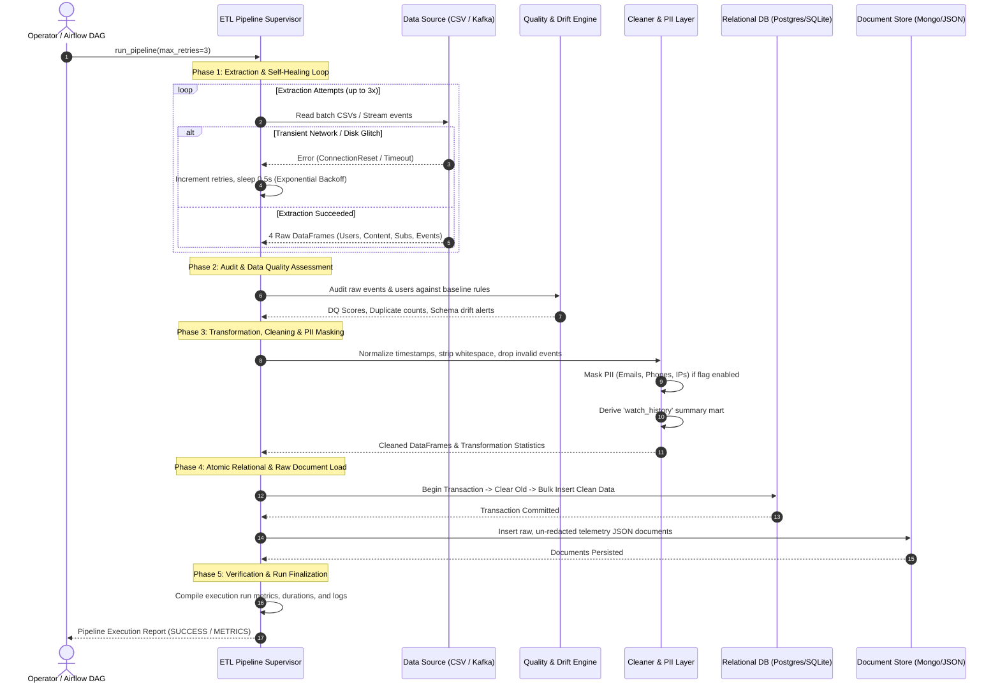
```mermaid
sequenceDiagram
    autonumber
    actor Trigger as Operator / Airflow DAG
    participant ETL as ETL Pipeline Supervisor
    participant Source as Data Source (CSV / Kafka)
    participant DQ as Quality & Drift Engine
    participant Clean as Cleaner & PII Layer
    participant Warehouse as Relational DB (Postgres/SQLite)
    participant DocStore as Document Store (Mongo/JSON)

    Trigger->>ETL: run_pipeline(max_retries=3)
    Note over ETL: Phase 1: Extraction & Self-Healing Loop
    loop Extraction Attempts (up to 3x)
        ETL->>Source: Read batch CSVs / Stream events
        alt Transient Network / Disk Glitch
            Source-->>ETL: Error (ConnectionReset / Timeout)
            ETL->>ETL: Increment retries, sleep 0.5s (Exponential Backoff)
        else Extraction Succeeded
            Source-->>ETL: 4 Raw DataFrames (Users, Content, Subs, Events)
        end
    end

    Note over ETL: Phase 2: Audit & Data Quality Assessment
    ETL->>DQ: Audit raw events & users against baseline rules
    DQ-->>ETL: DQ Scores, Duplicate counts, Schema drift alerts

    Note over ETL: Phase 3: Transformation, Cleaning & PII Masking
    ETL->>Clean: Normalize timestamps, strip whitespace, drop invalid events
    Clean->>Clean: Mask PII (Emails, Phones, IPs) if flag enabled
    Clean->>Clean: Derive 'watch_history' summary mart
    Clean-->>ETL: Cleaned DataFrames & Transformation Statistics

    Note over ETL: Phase 4: Atomic Relational & Raw Document Load
    ETL->>Warehouse: Begin Transaction -> Clear Old -> Bulk Insert Clean Data
    Warehouse-->>ETL: Transaction Committed
    ETL->>DocStore: Insert raw, un-redacted telemetry JSON documents
    DocStore-->>ETL: Documents Persisted

    Note over ETL: Phase 5: Verification & Run Finalization
    ETL->>ETL: Compile execution run metrics, durations, and logs
    ETL-->>Trigger: Pipeline Execution Report (SUCCESS / METRICS)
```

### Detailed Breakdown of the 5 ETL Phases:

#### Phase 1: Extract (with Resilience Supervisor)
- Reads the 4 primary source datasets (`users.csv`, `content.csv`, `subscriptions.csv`, `events.csv`).
- Protected by a configurable supervisor (`max_retries=3`). If a transient I/O glitch, locked file descriptor, or network timeout occurs, the runner logs a warning, waits with backoff, and re-attempts extraction without crashing the host process.

#### Phase 2: Audit & Data Quality Assessment
- Evaluates raw event and user feeds *prior* to mutation.
- Checks schema integrity, flags schema drift (new unexpected columns or missing baseline fields), counts duplicate IDs, and establishes the raw baseline Data Quality Score.

#### Phase 3: Transform & Cleanse
- **Normalization:** Enforces uniform timestamps (`YYYY-MM-DD HH:MM:SS`), coerces numeric types, and fills empty optional dimensions (`device`, `session_id`).
- **Deduplication:** Filters out redundant event entries based on `event_id`.
- **Validation Filtering:** Drops invalid event actions (e.g. `hacked_action`) and impossible watch times ($<0$ or $>1440$ minutes).
- **PII Governance:** Applies regex redaction to personal identifiers if compliance mode is enabled.
- **Marts Derivation:** Aggregates individual `video_watch` events to derive the `watch_history` analytical mart (calculating `total_watch_time_mins` and `completion_percentage` against catalog runtimes).

#### Phase 4: Load & Polyglot Synchronization
- **Relational Warehousing:** Executes an atomic transaction against PostgreSQL (or SQLite). Tables are cleared and repopulated in strict foreign-key order: `users` ➔ `content` ➔ `subscriptions` ➔ `events` ➔ `watch_history`.
- **Raw Document Persistence:** Asynchronously maps un-redacted events into nested JSON BSON-style objects and writes them to MongoDB (or `data/raw_events_store.json`) for forensic audits.

#### Phase 5: Verification & Metrics Telemetry
- Computes final throughput metrics: total extracted records, valid rows loaded, invalid rows discarded, and overall pipeline execution duration (typically $<200\text{ms}$ locally).

---

## 📡 Real-Time Streaming & Kafka Architecture

In production OTT architectures, telemetry does not wait for nightly batch jobs. DataStream AI implements a real-time event streaming pipeline using **Apache Kafka** with an automated **Local Stream Simulator** fallback.

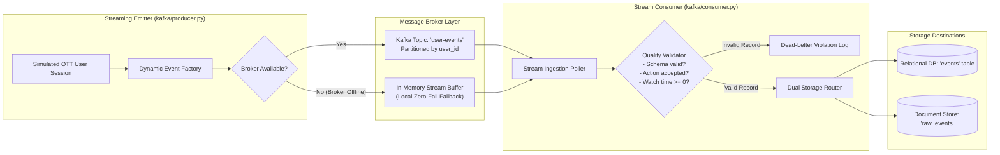
```mermaid
flowchart LR
    subgraph PRODUCER["Streaming Emitter (kafka/producer.py)"]
        CLIENT[Simulated OTT User Session]
        EVENT_GEN[Dynamic Event Factory]
        PROD_ROUTER{Broker Available?}
    end

    subgraph BROKER["Message Broker Layer"]
        KAFKA_TOPIC["Kafka Topic: 'user-events'<br/>Partitioned by user_id"]
        IN_MEM_BUF["In-Memory Stream Buffer<br/>(Local Zero-Fail Fallback)"]
    end

    subgraph CONSUMER["Stream Consumer (kafka/consumer.py)"]
        STREAM_IN[Stream Ingestion Poller]
        VALIDATOR{Quality Validator<br/>- Schema valid?<br/>- Action accepted?<br/>- Watch time >= 0?}
        DEAD_LETTER[Dead-Letter Violation Log]
        ROUTER[Dual Storage Router]
    end

    subgraph STORAGE["Storage Destinations"]
        RELATIONAL[(Relational DB: 'events' table)]
        DOC_STORE[(Document Store: 'raw_events')]
    end

    CLIENT --> EVENT_GEN
    EVENT_GEN --> PROD_ROUTER
    PROD_ROUTER -- "Yes" --> KAFKA_TOPIC
    PROD_ROUTER -- "No (Broker Offline)" --> IN_MEM_BUF

    KAFKA_TOPIC --> STREAM_IN
    IN_MEM_BUF --> STREAM_IN
    STREAM_IN --> VALIDATOR

    VALIDATOR -- "Invalid Record" --> DEAD_LETTER
    VALIDATOR -- "Valid Record" --> ROUTER
    ROUTER --> RELATIONAL
    ROUTER --> DOC_STORE
```

### Telemetry Event Schema & Action Taxonomy:
Each event emitted across the streaming bus adheres to a structured JSON schema:

| Field Name | Type | Constraint | Description |
| :--- | :--- | :--- | :--- |
| `event_id` | `VARCHAR(50)` | Primary Key | Unique UUID or incremental identifier (e.g. `EVT1042`). |
| `user_id` | `VARCHAR(50)` | Foreign Key | References subscriber profile in `users` table. |
| `event_type` | `VARCHAR(50)` | Accepted Set | One of 7 valid actions: `user_login`, `content_view`, `video_watch`, `search`, `add_to_watchlist`, `subscription`, `logout`. |
| `content_id` | `VARCHAR(50)` | Foreign Key (Nullable)| Target title (e.g. `MOV101`); null for login/logout actions. |
| `watch_time_mins` | `INTEGER` | $\ge 0$ | Total streamed minutes during the session chunk. |
| `device` | `VARCHAR(50)` | Accepted Set | Client form factor: `Smart TV`, `Mobile`, `Web`, `Tablet`. |
| `session_id` | `VARCHAR(100)`| Dimension | Unique playback session identifier. |
| `timestamp` | `TIMESTAMP` | ISO 8601 | Accurate event dispatch timestamp (`YYYY-MM-DD HH:MM:SS`). |
| `ip_address` | `VARCHAR(50)` | IPv4 Format | Client egress IP address for anomaly detection. |

---

## 🛡️ Data Quality Engine, Governance & DPDP Compliance

Data quality is not treated as an afterthought in DataStream AI; it is an active gatekeeper enforced through `pipeline/validation.py`, `pipeline/schema_drift.py`, and `pipeline/privacy.py`.

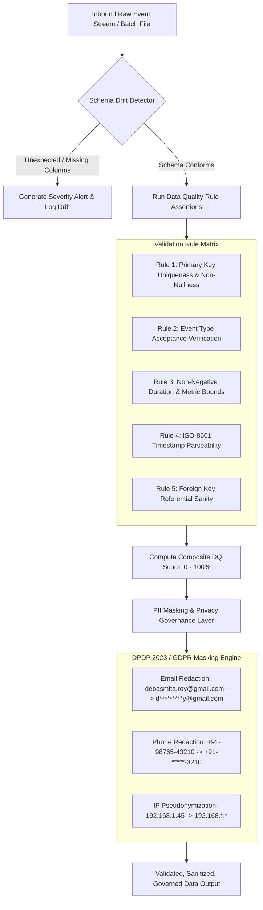
```mermaid
flowchart TD
    RAW[Inbound Raw Event Stream / Batch File] --> DRIFT_CHECK{Schema Drift Detector}
    
    DRIFT_CHECK -- "Unexpected / Missing Columns" --> DRIFT_ALERT[Generate Severity Alert & Log Drift]
    DRIFT_CHECK -- "Schema Conforms" --> DQ_CHECK[Run Data Quality Rule Assertions]
    
    subgraph RULES["Validation Rule Matrix"]
        R1[Rule 1: Primary Key Uniqueness & Non-Nullness]
        R2[Rule 2: Event Type Acceptance Verification]
        R3[Rule 3: Non-Negative Duration & Metric Bounds]
        R4[Rule 4: ISO-8601 Timestamp Parseability]
        R5[Rule 5: Foreign Key Referential Sanity]
    end
    
    DQ_CHECK --> RULES
    RULES --> DQ_SCORE[Compute Composite DQ Score: 0 - 100%]
    
    DQ_SCORE --> PRIVACY[PII Masking & Privacy Governance Layer]
    subgraph PII_LAYER["DPDP 2023 / GDPR Masking Engine"]
        M1["Email Redaction: debasmita.roy@gmail.com -> d*********y@gmail.com"]
        M2["Phone Redaction: +91-98765-43210 -> +91-*****-3210"]
        M3["IP Pseudonymization: 192.168.1.45 -> 192.168.*.*"]
    end
    PRIVACY --> PII_LAYER
    PII_LAYER --> CLEAN_OUT[Validated, Sanitized, Governed Data Output]
```

### 1. Mathematical Data Quality Scoring Model:
The system dynamically computes an objective Data Quality score ($DQ$) for every dataset:

$$DQ = \max\left(0, 100 - \left(P_{\text{dup}} \times N_{\text{dup}} + P_{\text{null}} \times N_{\text{null}} + P_{\text{verb}} \times N_{\text{verb}} + P_{\text{num}} \times N_{\text{num}} + P_{\text{date}} \times N_{\text{date}}\right)\right)$$

*Where:*
- $P_{\text{dup}} = 10$: Penalty per duplicate primary key.
- $P_{\text{null}} = 15$: Penalty per missing critical identity key (`event_id`, `user_id`).
- $P_{\text{verb}} = 8$: Penalty per unrecognized event action verb (e.g. `hacked_action`).
- $P_{\text{num}} = 5$: Penalty per impossible metric value (e.g. negative watch minutes).
- $P_{\text{date}} = 10$: Penalty per unparseable datetime string.

### 2. Schema Drift Detection:
Client updates inevitably alter telemetry payloads. `pipeline/schema_drift.py` checks incoming DataFrames against fixed baseline contracts:
- **Expansion Drift (WARNING):** New unrecognized attributes detected (e.g. `client_battery_level`). Logged and isolated without crashing the pipeline.
- **Contraction Drift (CRITICAL):** Missing required schema columns (e.g. `timestamp`). Halts ingestion to protect downstream relational integrity.
- **Type Drift (HIGH):** Data types mutated (e.g. numeric `watch_time_mins` sent as alphanumeric text). Handled via defensive type casting.

### 3. Privacy Engineering & DPDP Compliance:
Under India's **Digital Personal Data Protection (DPDP) Act 2023** and **GDPR**, storing raw user identifiers in downstream analytics marts exposes organizations to compliance penalties. DataStream AI automatically isolates and redacts PII at the warehouse boundary:
- **Email Masking:** Preserves initial character and domain for demographic grouping while masking identity (`d*********y@gmail.com`).
- **Phone Redaction:** Masks internal digits, preserving only the international dial code and last 4 digits for SMS billing verification (`+91-*****-3210`).
- **IP Pseudonymization:** Zeroes the final two octets (`192.168.*.*`), preventing exact geolocation while preserving ISP / regional routing analysis.

---

## 🗄️ Multi-Model Polyglot Storage Architecture

DataStream AI embraces **Polyglot Persistence**, pairing an ANSI-SQL relational database with a document store to balance analytical rigor with semi-structured flexibility.

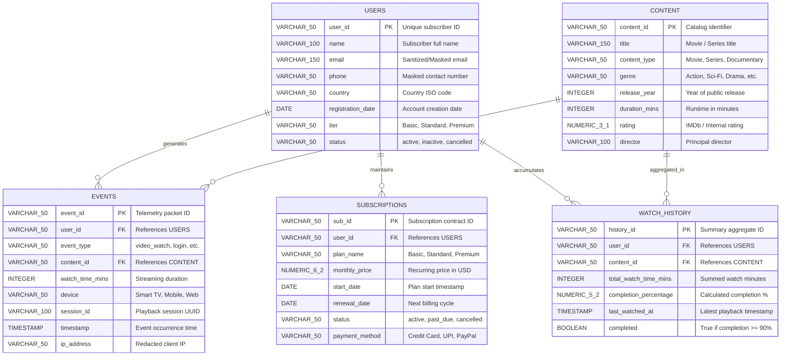
```mermaid
erDiagram
    USERS ||--o{ EVENTS : generates
    USERS ||--o{ SUBSCRIPTIONS : maintains
    USERS ||--o{ WATCH_HISTORY : accumulates
    CONTENT ||--o{ EVENTS : referenced_in
    CONTENT ||--o{ WATCH_HISTORY : aggregated_in

    USERS {
        VARCHAR_50 user_id PK "Unique subscriber ID"
        VARCHAR_100 name "Subscriber full name"
        VARCHAR_150 email "Sanitized/Masked email"
        VARCHAR_50 phone "Masked contact number"
        VARCHAR_50 country "Country ISO code"
        DATE registration_date "Account creation date"
        VARCHAR_50 tier "Basic, Standard, Premium"
        VARCHAR_50 status "active, inactive, cancelled"
    }

    CONTENT {
        VARCHAR_50 content_id PK "Catalog identifier"
        VARCHAR_150 title "Movie / Series title"
        VARCHAR_50 content_type "Movie, Series, Documentary"
        VARCHAR_50 genre "Action, Sci-Fi, Drama, etc."
        INTEGER release_year "Year of public release"
        INTEGER duration_mins "Runtime in minutes"
        NUMERIC_3_1 rating "IMDb / Internal rating"
        VARCHAR_100 director "Principal director"
    }

    SUBSCRIPTIONS {
        VARCHAR_50 sub_id PK "Subscription contract ID"
        VARCHAR_50 user_id FK "References USERS"
        VARCHAR_50 plan_name "Basic, Standard, Premium"
        NUMERIC_6_2 monthly_price "Recurring price in USD"
        DATE start_date "Plan start timestamp"
        DATE renewal_date "Next billing cycle"
        VARCHAR_50 status "active, past_due, cancelled"
        VARCHAR_50 payment_method "Credit Card, UPI, PayPal"
    }

    EVENTS {
        VARCHAR_50 event_id PK "Telemetry packet ID"
        VARCHAR_50 user_id FK "References USERS"
        VARCHAR_50 event_type "video_watch, login, etc."
        VARCHAR_50 content_id FK "References CONTENT"
        INTEGER watch_time_mins "Streaming duration"
        VARCHAR_50 device "Smart TV, Mobile, Web"
        VARCHAR_100 session_id "Playback session UUID"
        TIMESTAMP timestamp "Event occurrence time"
        VARCHAR_50 ip_address "Redacted client IP"
    }

    WATCH_HISTORY {
        VARCHAR_50 history_id PK "Summary aggregate ID"
        VARCHAR_50 user_id FK "References USERS"
        VARCHAR_50 content_id FK "References CONTENT"
        INTEGER total_watch_time_mins "Summed watch minutes"
        NUMERIC_5_2 completion_percentage "Calculated completion %"
        TIMESTAMP last_watched_at "Latest playback timestamp"
        BOOLEAN completed "True if completion >= 90%"
    }
```

### Storage Engine Failover Matrix:

| Storage Role | Primary Production Engine | Automatic Local Fallback | Fallback Trigger Condition |
| :--- | :--- | :--- | :--- |
| **Relational Warehouse** | PostgreSQL 15 on port `5432` | SQLite 3 (`data/datastream.db`) | PostgreSQL connection refused / daemon offline |
| **Document Store** | MongoDB 6.0 on port `27017` | Local JSON Store (`data/raw_events_store.json`) | MongoDB server unreachable / auth failed |
| **Streaming Broker** | Apache Kafka 7.5 on port `9092` | In-Memory FIFO Queue Buffer | Kafka broker unreachable / timeouts |

---

## 📊 Transformations, dbt Marts & Analytical SQL Suite

The transformation layer models raw operational records into high-performance dimensional star-schema marts ready for BI and ML consumption.

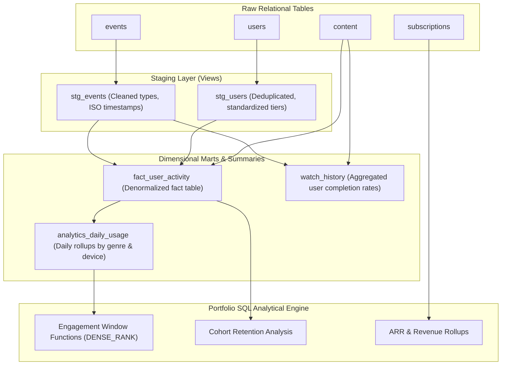
```mermaid
flowchart TD
    subgraph RAW_TABLES["Raw Relational Tables"]
        R_EVT[events]
        R_USR[users]
        R_CNT[content]
        R_SUB[subscriptions]
    end

    subgraph STAGING["Staging Layer (Views)"]
        STG_EVT["stg_events (Cleaned types, ISO timestamps)"]
        STG_USR["stg_users (Deduplicated, standardized tiers)"]
    end

    subgraph MARTS["Dimensional Marts & Summaries"]
        FACT_ACT["fact_user_activity (Denormalized fact table)"]
        MART_USAGE["analytics_daily_usage (Daily rollups by genre & device)"]
        MART_HIST["watch_history (Aggregated user completion rates)"]
    end

    subgraph SQL_ANALYTICS["Portfolio SQL Analytical Engine"]
        CTE_ENG["Engagement Window Functions (DENSE_RANK)"]
        COHORT["Cohort Retention Analysis"]
        MONEY["ARR & Revenue Rollups"]
    end

    R_EVT --> STG_EVT
    R_USR --> STG_USR
    
    STG_EVT --> FACT_ACT
    STG_USR --> FACT_ACT
    R_CNT --> FACT_ACT
    
    FACT_ACT --> MART_USAGE
    STG_EVT --> MART_HIST
    R_CNT --> MART_HIST

    MART_USAGE --> CTE_ENG
    FACT_ACT --> COHORT
    R_SUB --> MONEY
```

### Portfolio SQL Analytical Queries:

#### 1. Content Engagement & Genre Rank (Window Functions & CTEs):
Calculates total streaming volume and ranks content performance within each genre:
```sql
WITH content_watch_summary AS (
    SELECT 
        c.content_id,
        c.title,
        c.genre,
        c.rating,
        COUNT(e.event_id) AS total_stream_sessions,
        SUM(e.watch_time_mins) AS total_watch_minutes
    FROM content c
    JOIN events e ON c.content_id = e.content_id
    WHERE e.event_type = 'video_watch'
    GROUP BY c.content_id, c.title, c.genre, c.rating
)
SELECT 
    title,
    genre,
    total_watch_minutes,
    total_stream_sessions,
    rating,
    DENSE_RANK() OVER (
        PARTITION BY genre 
        ORDER BY total_watch_minutes DESC
    ) AS genre_rank
FROM content_watch_summary
ORDER BY genre, genre_rank;
```

#### 2. Daily Platform Usage Rollup (`analytics_daily_usage`):
Aggregates distinct active users, total minutes watched, and completion rates by calendar date:
```sql
SELECT 
    DATE(e.timestamp) AS activity_date,
    COUNT(DISTINCT e.user_id) AS daily_active_users,
    SUM(e.watch_time_mins) AS total_platform_minutes,
    AVG(e.watch_time_mins) AS avg_session_duration,
    COUNT(CASE WHEN e.event_type = 'video_watch' THEN 1 END) AS total_plays
FROM events e
GROUP BY DATE(e.timestamp)
ORDER BY activity_date DESC;
```

---

## 🤖 Predictive & Generative AI Subsystems

DataStream AI embeds a five-pillar AI subsystem delivering real-time decision support, recommendation, fraud mitigation, and conversational intelligence.

### 1. Subscriber Churn Prediction & Retention Engine
Predicting subscriber churn before cancellation is the highest-ROI application of OTT analytics. `ai/churn_predictor.py` aggregates behavioral telemetry per user to construct a multidimensional feature vector:

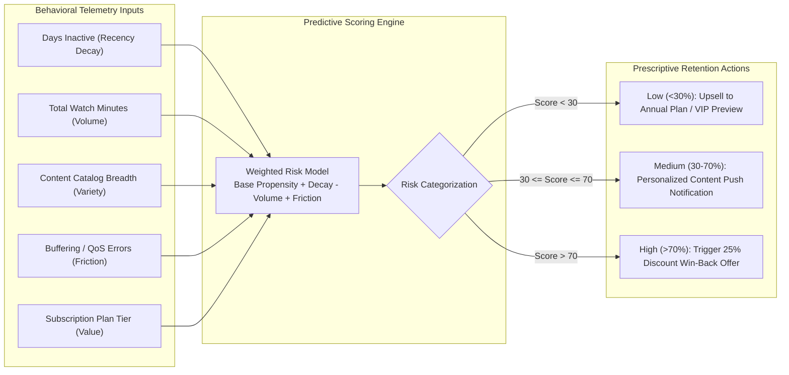
```mermaid
flowchart LR
    subgraph SIGNALS["Behavioral Telemetry Inputs"]
        S1["Days Inactive (Recency Decay)"]
        S2["Total Watch Minutes (Volume)"]
        S3["Content Catalog Breadth (Variety)"]
        S4["Buffering / QoS Errors (Friction)"]
        S5["Subscription Plan Tier (Value)"]
    end

    subgraph INFERENCE["Predictive Scoring Engine"]
        HEURISTIC["Weighted Risk Model<br/>Base Propensity + Decay - Volume + Friction"]
        TIERS{Risk Categorization}
    end

    subgraph ACTIONS["Prescriptive Retention Actions"]
        ACT_LOW["Low (<30%): Upsell to Annual Plan / VIP Preview"]
        ACT_MED["Medium (30-70%): Personalized Content Push Notification"]
        ACT_HIGH["High (>70%): Trigger 25% Discount Win-Back Offer"]
    end

    S1 & S2 & S3 & S4 & S5 --> HEURISTIC
    HEURISTIC --> TIERS
    TIERS -->|Score < 30| ACT_LOW
    TIERS -->|30 <= Score <= 70| ACT_MED
    TIERS -->|Score > 70| ACT_HIGH
```

- **Inactivity Decay:** Adds $+40$ points if inactive $>20$ days; subtracts $-10$ points if active within 5 days.
- **Consumption Volume:** Adds $+25$ points for $<30$ total streamed minutes; subtracts $-20$ points for heavy users ($>150$ mins).
- **QoS Friction:** Adds $+15$ points for frequent buffering/error pings.

### 2. Personalized Content Recommendation Engine
`ai/recommendation.py` implements a hybrid recommendation strategy:
1. **Taste Profile Extraction:** Inspects user historical watch events, building a weighted preference histogram of favorite genres and preferred directors.
2. **Cosine Similarity & Match Scoring:** Scores all unwatched catalog titles against user taste vectors, applying boosting factors for high IMDb ratings.
3. **Cold-Start Fallback:** For new subscribers with zero telemetry history, the engine falls back to trending, high-rated titles ($\text{rating} \ge 7.0$).

### 3. Streaming Anomaly & Security Radar
`pipeline/anomaly_detector.py` scans streaming events in real time to catch operational hazards:
- **Credential Sharing / Account Fraud:** Flags subscriber accounts active across $>2$ distinct IP addresses and multiple device form factors simultaneously. Recommends triggering 2FA re-verification or prompting for a Family Plan upgrade.
- **CDN QoS Buffering Spikes:** Calculates the ratio of `buffering` and `playback_failed` events. If the friction ratio exceeds **10%** of total stream volume, triggers a HIGH severity alert recommending an edge POP reroute or adaptive bitrate downscaling.
- **Scraper / Bot Detection:** Flags continuous streaming sessions exceeding 240 uninterrupted minutes without user interaction.

### 4. Natural Language "Ask Your Data" Analytics Agent
`ai/ask_data.py` bridges non-technical executives and raw database tables via a **grounded Text-to-SQL engine**:

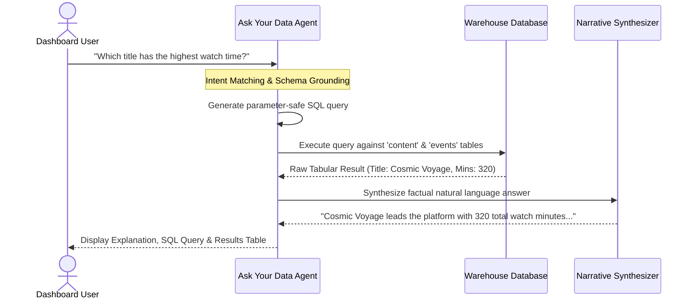
```mermaid
sequenceDiagram
    actor Executive as Dashboard User
    participant Agent as Ask Your Data Agent
    participant DB as Warehouse Database
    participant LLM as Narrative Synthesizer

    Executive->>Agent: "Which title has the highest watch time?"
    Note over Agent: Intent Matching & Schema Grounding
    Agent->>Agent: Generate parameter-safe SQL query
    Agent->>DB: Execute query against 'content' & 'events' tables
    DB-->>Agent: Raw Tabular Result (Title: Cosmic Voyage, Mins: 320)
    Agent->>LLM: Synthesize factual natural language answer
    LLM-->>Agent: "Cosmic Voyage leads the platform with 320 total watch minutes..."
    Agent-->>Executive: Display Explanation, SQL Query & Results Table
```
*Zero Hallucination Guarantee:* The agent refuses to guess. If a query is ambiguous, it returns schema constraints rather than fabricating numbers.

### 5. Semantic Knowledge Base (RAG Subsystem)
`ai/rag.py`, `ai/chunking.py`, and `ai/embeddings.py` implement an offline-first **Retrieval Augmented Generation (RAG)** pipeline indexing unstructured documentation (`docs/platform_overview.txt`, `docs/ott_content_catalog.txt`):

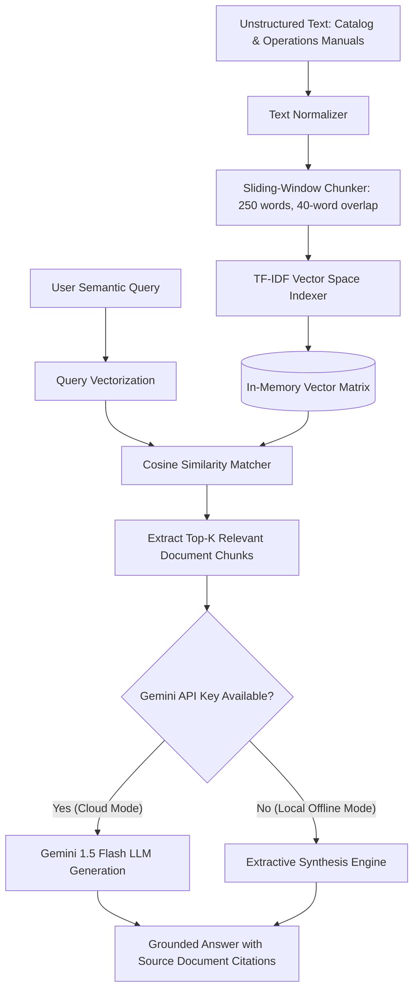
```mermaid
flowchart TD
    DOCS[Unstructured Text: Catalog & Operations Manuals] --> CLEAN[Text Normalizer]
    CLEAN --> SLIDING[Sliding-Window Chunker: 250 words, 40-word overlap]
    SLIDING --> TFIDF[TF-IDF Vector Space Indexer]
    TFIDF --> VEC_DB[(In-Memory Vector Matrix)]

    USER_Q[User Semantic Query] --> Q_VEC[Query Vectorization]
    Q_VEC --> COS_SIM[Cosine Similarity Matcher]
    VEC_DB --> COS_SIM
    COS_SIM --> TOP_K[Extract Top-K Relevant Document Chunks]

    TOP_K --> SYNTH{Gemini API Key Available?}
    SYNTH -- "Yes (Cloud Mode)" --> GEMINI_GEN[Gemini 1.5 Flash LLM Generation]
    SYNTH -- "No (Local Offline Mode)" --> LOCAL_GEN[Extractive Synthesis Engine]
    GEMINI_GEN --> FINAL_ANS[Grounded Answer with Source Document Citations]
    LOCAL_GEN --> FINAL_ANS
```

---

## 🖥️ Streamlit Observability Dashboard (12 Interactive Modules)

The platform is monitored through a 12-tab Streamlit application (`app/dashboard.py`), featuring glassmorphic cards, dynamic Plotly charts, and manual pipeline triggers.

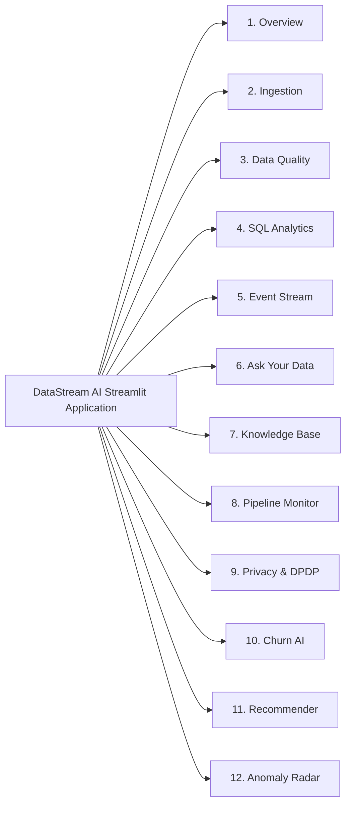
```mermaid
flowchart LR
    UI[DataStream AI Streamlit Application]
    UI --> T1[1. Overview]
    UI --> T2[2. Ingestion]
    UI --> T3[3. Data Quality]
    UI --> T4[4. SQL Analytics]
    UI --> T5[5. Event Stream]
    UI --> T6[6. Ask Your Data]
    UI --> T7[7. Knowledge Base]
    UI --> T8[8. Pipeline Monitor]
    UI --> T9[9. Privacy & DPDP]
    UI --> T10[10. Churn AI]
    UI --> T11[11. Recommender]
    UI --> T12[12. Anomaly Radar]
```

| Tab | Name | Primary Functionality & Interactive Features |
| :---: | :--- | :--- |
| **1** | **📊 Overview** | Top-level KPI cards (Total Users, Catalog Titles, Total Events, DQ Score, Warehouse Status), event volume breakdown, and storage footprint summary. |
| **2** | **📥 Ingestion** | Batch CSV preview, live Kafka topic status, raw record counters, and ingestion history log. |
| **3** | **🛡️ Data Quality** | Real-time Data Quality Gauge (0–100%), rule violation breakdown, schema drift alert inspector, and before/after cleansing comparator. |
| **4** | **⚡ SQL Analytics** | Interactive SQL query runner with pre-built queries (Top Content, Churn by Tier, Cohort Retention, Window Rank) and custom query execution with safety limits. |
| **5** | **📡 Event Stream** | Interactive Kafka producer/consumer console allowing operators to emit custom user events and observe real-time stream routing. |
| **6** | **🤖 Ask Your Data** | Conversational Text-to-SQL interface translating natural language business questions into verifiable database queries. |
| **7** | **📚 Knowledge Base** | Semantic RAG search interface allowing operators to query operational guidelines and content catalogs with chunk similarity metrics. |
| **8** | **🔄 Pipeline Monitor** | Step-by-step ETL execution timeline, run latency diagnostics, self-healing retry logs, and one-click manual pipeline trigger. |
| **9** | **🔒 Privacy & DPDP** | Interactive PII Redaction simulator demonstrating email, phone, and IP masking compliance under the DPDP Act 2023. |
| **10**| **🎯 Churn & AI Retention**| Fleet-wide subscriber churn risk distribution, individual user risk breakdown gauges, and automated win-back action recommendations. |
| **11**| **🎬 Content Recommender** | Interactive recommendation engine displaying personalized top picks, genre affinity radar charts, match score badges, and explanation rationale. |
| **12**| **🚨 Streaming Anomaly Radar**| Real-time threat monitor flagging concurrent IP credential sharing, CDN buffering friction spikes, and scraper bot anomalies. |

---

## ⏱️ Apache Airflow Orchestration

For enterprise scheduling, `airflow/data_pipeline.py` exposes a 5-step Directed Acyclic Graph (DAG) scheduled for daily execution:

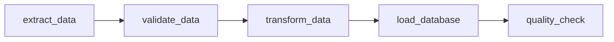
```mermaid
flowchart LR
    T1[extract_data] --> T2[validate_data]
    T2 --> T3[transform_data]
    T3 --> T4[load_database]
    T4 --> T5[quality_check]
```

- **`extract_data`:** Ingests batch CSV files and Kafka queue dumps into staging memory.
- **`validate_data`:** Executes schema drift assertions and verifies foreign key integrity.
- **`transform_data`:** Normalizes datetime fields, strips whitespace, filters invalid actions, and masks PII.
- **`load_database`:** Performs atomic upserts into PostgreSQL and raw JSON writes to MongoDB.
- **`quality_check`:** Executes post-load row count consistency checks and validates data freshness.

---

## 📂 Project File & Directory Layout

```text
DataStream AI/
├── app/
│   └── dashboard.py               # 12-tab Streamlit observability & analytics application
├── pipeline/
│   ├── ingestion.py               # Unified CSV batch and Kafka streaming ingestion controller
│   ├── cleaning.py                # Data normalization, whitespace stripping, and date casting
│   ├── validation.py              # Data Quality rule assertions & dynamic scoring engine
│   ├── schema_drift.py            # Baseline schema contract comparator & drift detector
│   ├── privacy.py                 # DPDP Act & GDPR PII detection and regex redaction
│   ├── etl_pipeline.py            # 5-phase ETL supervisor with self-healing retry backoff
│   ├── dbt_runner.py              # Embedded dbt staging models and schema assertion runner
│   └── anomaly_detector.py        # Real-time QoS buffering, credential sharing & bot radar
├── database/
│   ├── postgres.py                # Relational warehouse manager with zero-fail SQLite fallback
│   ├── mongodb.py                 # Document store manager with local JSON file fallback
│   └── schema.sql                 # ANSI SQL DDL schema definitions (Users, Content, Events, etc.)
├── kafka/
│   ├── producer.py                # Simulated OTT telemetry emitter with in-memory buffer fallback
│   └── consumer.py                # Real-time event consumer, stream validator, and router
├── ai/
│   ├── churn_predictor.py         # Subscriber churn risk prediction & retention playbooks
│   ├── recommendation.py          # Hybrid content/collaborative filtering recommender
│   ├── chunking.py                # Document preprocessor & sliding-window text chunker
│   ├── embeddings.py              # Local Scikit-Learn TF-IDF vector space & Gemini API bridge
│   ├── rag.py                     # Retrieval Augmented Generation engine over documentation
│   └── ask_data.py                # Natural language "Ask Your Data" Text-to-SQL analytics agent
├── airflow/
│   └── data_pipeline.py           # Apache Airflow DAG defining the 5-step ETL workflow
├── dbt/
│   ├── dbt_project.yml            # dbt configuration project definition
│   └── models/                    # Staging models, mart definitions, and test schema YAMLs
├── sql/
│   └── analytics.sql              # Portfolio SQL suite (CTEs, Window Functions, Cohorts)
├── data/
│   ├── users.csv                  # Subscriber profiles with intentional test duplicate
│   ├── content.csv                # Content catalog metadata, durations, and IMDb ratings
│   ├── subscriptions.csv          # Subscription plans, pricing tiers, and billing dates
│   └── events.csv                 # Raw user telemetry with intentional dirty test records
├── docs/
│   ├── architecture.md            # Deep-dive architectural specification
│   ├── platform_overview.txt      # OTT platform operations & architecture guide for RAG
│   └── ott_content_catalog.txt     # Content catalog synopses & descriptions for RAG
├── tests/
│   ├── conftest.py                # Pytest root configuration
│   ├── test_pipeline.py           # Pipeline, validation, drift, PII & SQL tests (11 tests)
│   └── test_ai_features.py        # Churn, recommender, and anomaly detection tests (8 tests)
├── .env.example                   # Environment variable template
├── requirements.txt               # Locked Python dependencies
├── docker-compose.yml             # Multi-service container orchestration (Postgres, Mongo, Kafka, UI)
├── Dockerfile                     # Production container image definition
├── AI_DEVELOPMENT.md              # Engineering log documenting AI pairing & debugging cycles
├── LICENSE                        # MIT Open Source License
└── README.md                      # Comprehensive project documentation
```

---

## ⚙️ Quick Start & Setup Instructions

### 1. Prerequisites
- **Python 3.12+** installed on your system.
- Git installed.
- *(Optional)* Docker Desktop if running containerized services.

### 2. Clone Repository & Setup Virtual Environment
```bash
# Clone the repository
git clone https://github.com/DebasmitaBose0/DataStreamAI.git
cd DataStreamAI

# Create virtual environment
python -m venv venv

# Activate virtual environment
# Windows (PowerShell):
.\venv\Scripts\Activate.ps1
# Windows (Command Prompt):
.\venv\Scripts\activate.bat
# macOS / Linux:
source venv/bin/activate

# Upgrade pip and install dependencies
pip install --upgrade pip
pip install -r requirements.txt
```

### 3. Configure Environment Variables
Copy the environment template:
```bash
cp .env.example .env
```
> [!TIP]
> **Zero External Dependencies Required:**  
> All external services (PostgreSQL, MongoDB, Apache Kafka, Google Gemini API) are completely **optional**. If any service is not detected, DataStream AI automatically activates its built-in local fallbacks (SQLite, local JSON store, and in-memory queue), allowing the entire system to run out-of-the-box!

### 4. Launch the Streamlit Observability Dashboard
```bash
streamlit run app/dashboard.py
```
Open your browser and navigate to: **`http://localhost:8501`**

---

## 🧪 Automated Testing & Quality Assurance

DataStream AI includes an automated Pytest test suite covering data validation, schema drift, PII masking, ETL transformations, churn prediction, content recommendations, and anomaly detection.

```bash
python -m pytest tests/ -v
```

### Test Coverage Matrix (19/19 Tests Passing):

| Test Module | Test Class & Method | Validation Assertion | Status |
| :--- | :--- | :--- | :---: |
| `test_pipeline.py` | `TestPrivacyAndPII::test_mask_email` | Verifies email masking (`d*********y@gmail.com`) | `PASSED` |
| `test_pipeline.py` | `TestPrivacyAndPII::test_mask_phone` | Verifies phone digit masking (`+91-*****-3210`) | `PASSED` |
| `test_pipeline.py` | `TestPrivacyAndPII::test_mask_ip` | Verifies IPv4 subnet redaction (`192.168.*.*`) | `PASSED` |
| `test_pipeline.py` | `TestPrivacyAndPII::test_mask_dataframe` | Verifies batch DataFrame PII masking | `PASSED` |
| `test_pipeline.py` | `TestDataQualityAndValidation::test_duplicate_detection` | Verifies identification of duplicate event IDs | `PASSED` |
| `test_pipeline.py` | `TestDataQualityAndValidation::test_invalid_event_type_rejection` | Verifies rejection of unlisted actions (`hacked_action`) | `PASSED` |
| `test_pipeline.py` | `TestDataQualityAndValidation::test_negative_numeric_rejection` | Verifies rejection of negative watch minutes | `PASSED` |
| `test_pipeline.py` | `TestSchemaDrift::test_new_column_detection` | Verifies detection of unexpected schema expansion | `PASSED` |
| `test_pipeline.py` | `TestSchemaDrift::test_missing_column_detection` | Verifies detection of missing required columns | `PASSED` |
| `test_pipeline.py` | `TestCleaningAndTransformation::test_event_cleaning_deduplication` | Verifies event cleaning and duplicate removal | `PASSED` |
| `test_pipeline.py` | `TestDatabaseAndSQL::test_database_query_execution` | Verifies relational query execution & connection | `PASSED` |
| `test_ai_features.py` | `TestChurnPredictor::test_predict_all_users_structure` | Verifies churn output schema & score boundaries | `PASSED` |
| `test_ai_features.py` | `TestChurnPredictor::test_predict_single_user` | Verifies individual churn risk calculation | `PASSED` |
| `test_ai_features.py` | `TestChurnPredictor::test_fleet_summary` | Verifies fleet-wide churn risk aggregations | `PASSED` |
| `test_ai_features.py` | `TestContentRecommender::test_recommend_for_active_user` | Verifies personalized recommendation generation | `PASSED` |
| `test_ai_features.py` | `TestContentRecommender::test_cold_start_user` | Verifies cold-start fallback to trending content | `PASSED` |
| `test_ai_features.py` | `TestContentRecommender::test_similar_content` | Verifies item-to-item similarity calculation | `PASSED` |
| `test_ai_features.py` | `TestAnomalyDetector::test_anomaly_analysis_returns_list` | Verifies streaming anomaly radar scans | `PASSED` |
| `test_ai_features.py` | `TestAnomalyDetector::test_summary_metrics` | Verifies anomaly severity and metric calculations | `PASSED` |

---

## 🐳 Docker Containerized Deployment

To launch the full enterprise multi-container infrastructure including live PostgreSQL, MongoDB, Kafka, and the Streamlit UI:

```bash
docker-compose up -d --build
```

### Container Infrastructure Map:
- **`postgres`:** PostgreSQL 15 on port `5432` with auto-loaded `database/schema.sql`.
- **`mongodb`:** MongoDB 6.0 on port `27017`.
- **`zookeeper`:** Apache Zookeeper on port `2181`.
- **`kafka`:** Apache Kafka Broker on port `9092`.
- **`streamlit`:** DataStream AI Observability Dashboard on port `8501`.

To inspect running services:
```bash
docker-compose ps
```

To stop all containers:
```bash
docker-compose down
```

---

## 📄 License & Acknowledgments

This project is open-source software licensed under the **MIT License** — see the [LICENSE](LICENSE) file for complete details.

**Engineered with ❤️ by Debasmita Bose**  
*“From Raw Data to Intelligent Insights”*
