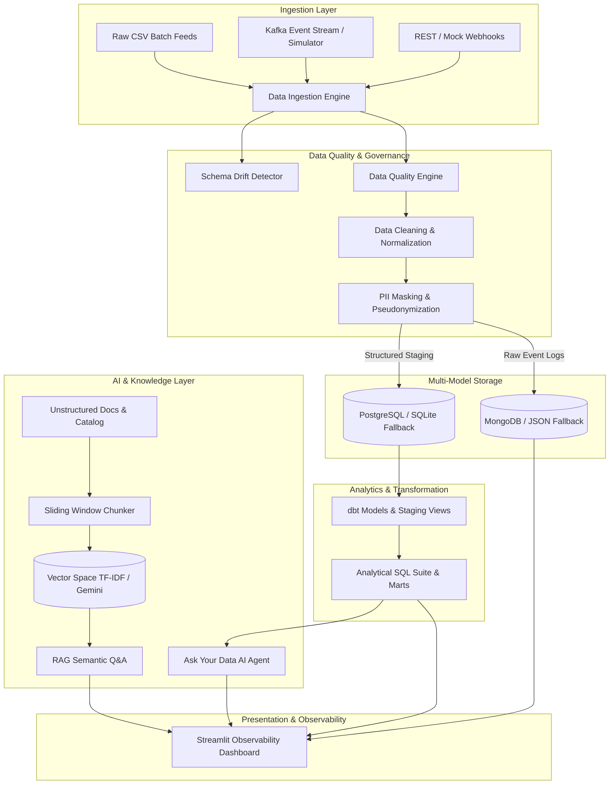

# DataStream AI - System Architecture & Engineering Specifications
> “From Raw Data to Intelligent Insights”

DataStream AI is a portfolio-level Data Engineering, Real-Time Ingestion, and AI Analytics platform simulating an OTT streaming service (e.g., Netflix / Prime Video).

---

## 1. High-Level System Architecture Diagram

---

## 2. Component Breakdown

### 2.1 Ingestion & Quality Engine
- **`pipeline/ingestion.py`**: Loads batch and streaming data, evaluates schema constraints, and tracks ingestion history.
- **`pipeline/schema_drift.py`**: Compares live dataset schemas against baseline definitions (`users`, `content`, `events`, `subscriptions`). Detects unexpected fields, removed columns, and type changes.
- **`pipeline/validation.py`**: Granular validation logic checking for duplicates, null primary keys, unparseable timestamps, out-of-bounds watch times, and invalid event types. Computes dynamic Data Quality Scores (0–100%).
- **`pipeline/cleaning.py`**: Normalizes timestamps (`YYYY-MM-DD HH:MM:SS`), cleans whitespace, and redacts PII.

### 2.2 Dual-Layer Storage
1. **Relational Database (`database/postgres.py`)**:
   - Primary: PostgreSQL on port 5432.
   - Resilient Fallback: SQLite (`data/datastream.db`) with identical schema and DDL (`database/schema.sql`).
2. **Document Store (`database/mongodb.py`)**:
   - Primary: MongoDB on port 27017.
   - Resilient Fallback: Local JSON file store (`data/raw_events_store.json`).

### 2.3 Streaming Infrastructure
- **`kafka/producer.py`**: Emits user events (`user_login`, `content_view`, `video_watch`, `search`, `add_to_watchlist`, `subscription`, `logout`) to topic `user-events`. Falls back to an in-memory stream buffer if Kafka is offline.
- **`kafka/consumer.py`**: Consumes streaming records, audits quality rules, and routes valid records to relational warehouse and raw document stores.

### 2.4 Orchestration & Transformations
- **`airflow/data_pipeline.py`**: Airflow DAG with 5 sequential tasks (`extract_data` -> `validate_data` -> `transform_data` -> `load_database` -> `quality_check`).
- **`dbt/`**: Models for staging views (`stg_events`, `stg_users`) and marts (`fact_user_activity`, `analytics_daily_usage`) with schema assertions (`schema.yml`). Includes an embedded runner (`pipeline/dbt_runner.py`) for environments without the dbt CLI.

### 2.5 AI & RAG Subsystem
- **`ai/chunking.py`**: Sliding-window chunker (250 words, 40-word overlap).
- **`ai/embeddings.py`**: Scikit-Learn TF-IDF vector space with cosine similarity for fast, 100% offline local vector search.
- **`ai/rag.py`**: Semantic retrieval and answer synthesis over OTT catalog and operational guidelines.
- **`ai/ask_data.py`**: Natural-language-to-SQL analytics agent that executes real queries against operational tables to answer questions with verifiable data.
